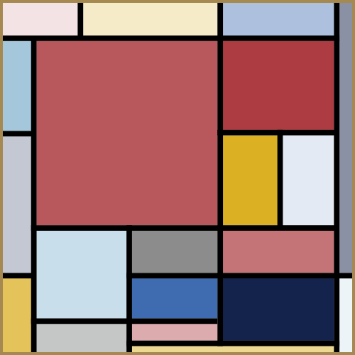
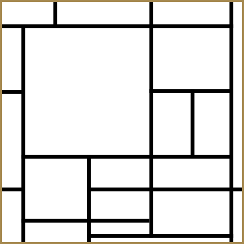

1. Inspiration
Our project is inspired by Piet Mondrian's Composition with Large Red Plane, Yellow, Black, Gray and Blue (1921), held by Kunstmuseum Den Haag. The painting's horizontal and vertical divisions, unequal rectangular areas and contrasting colors provide the starting point for our digital interpretation.
Rather than display a finished copy, we turn the composition into a process: watch the black divisions appear one stroke at a time, then explore color through personal choices or computer-generated variation. All the mechanics intend to work on the same canvas. The drawing order is our own interpretation, not a reconstruction of Mondrian's historical painting process.

2. Techniques

3. Mechanic ownership
CHUNG-EN CHEN	Time-based	Develops progressive grid drawing, stroke order, drawing speed and pauses. 
Jinsa Bai	User input	Develops colour selection, click-depth filling, erasing and undo/redo on the shared canvas.
	Perlin noise and randomness	
	Audio	

4. AI acknowledgement
ChatGPT (OpenAI) assisted with generating the initial prototype, explaining its JavaScript and p5.js logic, and suggesting the probable structure of the code. It also helped discuss interaction ideas, prepare presentation material and draft this README.

5. External references

6. Interaction instructions

## Jinsa — User input on the team canvas

This branch integrates Jinsa Bai's mechanic into CHUNG-EN CHEN's existing `time-based` project, at commit `74b40016646d89bb7f9f8483ca461c6fd8117b87`. That original project contains 14 strokes enclosing **20 cells**. The existing `9103 creative coding/time-lines.js` is preserved byte for byte. `perlin-noise-okun` pointed to that same commit when checked, so its separate mechanic was not yet present in GitHub.

### Run and interaction

Download [jinsa-team-grid.html](jinsa-team-grid.html) and open it in a browser. It is a self-contained copy of the integrated team canvas. Both the root `index.html` and the existing project's `index.html` run the same canvas. The page displays the square artwork and, after the line sequence, a row of seven colour swatches underneath it.

- The original black strokes draw one at a time, at their original positions, speed and pauses. The original dark-gold frame remains.
- Once all strokes have finished, the canvas cursor becomes a pointer and the palette appears. Click a swatch or press its number to select it. A gold outline highlights the selection; red is selected initially.
- Keys **1–7**, in order: red, yellow, blue, navy, light blue, near black, white eraser.
- Click any of the 20 cells to paint it with a pale tint of the selected colour. Repeat the same colour to deepen it through eight levels. At level eight, additional same-colour clicks change neither the count nor undo history.
- Choose a different colour and click that cell to replace its colour, starting again at level one. Each cell stores its own colour and depth.
- Each shade fills upward within the existing cell in about 0.35 seconds. Same-colour rapid clicks keep an unfinished fill moving. A different colour starts a new rising fill while preserving the part already painted underneath it. Clicking a divider, frame or outside the canvas changes nothing.
- White acts as an eraser: click a coloured cell to fill it with white and reset its depth. Erasing an already blank cell has no effect or undo entry.
- Shortcuts: Ctrl/⌘ Z undo, Ctrl/⌘ Shift Z or Ctrl/⌘ Y redo, C clear colours without replaying lines, S save the artwork canvas as PNG. The page has no visible headings or instruction text.

### Code structure and ownership

CHUNG-EN CHEN owns the original time-based line sequence and frame. Jinsa Bai owns `9103 creative coding/user-input.js` and the colour-input integration. The original `sketch.js` now assembles both modules on its single 500 × 500 canvas. This version integrates time-based and user-input mechanics only. Audio and the noise mechanic still require team integration.

`createSharedRegions(lines, Thickness)` derives the 20 cell bounds from the team's 320-unit line coordinates. These replace Jinsa's earlier independent 17-cell layout. The drawing loop paints colours below the visible black lines and repaints completed and active strokes before advancing the original animation. The original last-frame stroke lengths and gold frame are retained.

All 14 presentation techniques are used and labelled in the source:

| # | Technique | Use |
|---|---|---|
| 1 | `setup()` | Creates the team's single canvas and prepares its lines and colour objects. |
| 2 | `draw()` | Updates the input fill and runs the team's line sequence. |
| 3 | `mousePressed()` | Sends a left canvas press to the controller. Swatch clicks and number keys choose a colour. |
| 4 | `if / else` | Returns white for zero clicks, otherwise calculates colour depth. |
| 5 | Comparisons and logic | `>`, `<`, `===`, `&&`, `\|\|` test progress, counts, boundaries and dividers. |
| 6 | Variables | Each block stores `clickCount`, `currentHeight`, `targetHeight` and its selected colour. |
| 7 | Custom functions | `createSharedRegions()`, `createBlock()` and `resetComposition()`. |
| 8 | Array | `blocks = []` stores the 20 cells. |
| 9 | `push()` | Adds a new cell object. |
| 10 | `for...of` | Finds, updates and displays blocks. |
| 11 | Class, constructor, new | `ColourBlock`, `constructor()`, `new ColourBlock()`. |
| 12 | Methods | `contains()`, `grow()`, `update()`, `display()`. |
| 13 | Global and local | Global `inputControls`; local grid positions and growth speed; click count and height are object state. |
| 14 | Separate script | `user-input.js`, combined with `time-lines.js` by `sketch.js`. |

### AI acknowledgement and references

ChatGPT (OpenAI) assisted with generating and explaining the user-input mechanic, deriving the shared cell bounds, integrating drawing order, colour selection, tests and documentation. Source comments also acknowledge this help. Each cell blends white toward its chosen RGB colour using `Math.min(clickCount, 8) / 8`. Its height state animates that shade upward. Temporary layers preserve earlier painted areas when another colour interrupts a fill. Undo/redo snapshots store both the cell's colour index and click count; restores render that saved colour and depth.

The team source is retained and attributed. This interpretation of Mondrian's painting preserves the shared geometry and allows visitors to choose each cell's colour and depth. The stroke order is the team's interpretation, not a reconstruction of Mondrian's historical painting process.

- Original team branch: https://github.com/bjsss400-dot/9103-AAAAA1/tree/time-based
- p5.js input reference: https://p5js.org/reference/p5/mousePressed/
- p5.js reference: https://p5js.org/reference/ — drawing, frame updates, canvas coordinates and export.

### Validation and pilot

Run `node tests/user-input.test.cjs`. These tests use the actual teammate module and both integrated modules with a minimal p5/DOM adapter. They check one canvas, the unchanged team module, palette timing and highlighting, all seven selection shortcuts, depth limits, colour changes, erasing, boundary rejection, colour/depth history and matching offline source. They are logic checks, not browser testing.

With `@napi-rs/canvas`, run `RENDER_PREVIEW=1 node tests/user-input.test.cjs` to verify rendered colours, interrupted fills, white erasing, black lines and the gold frame and recreate the PNG. The pilot below renders actual callback invocations. The GIF selects paint colours using number keys and illustrates repeated clicks on all 20 cells; colouring in the webpage requires user input.

